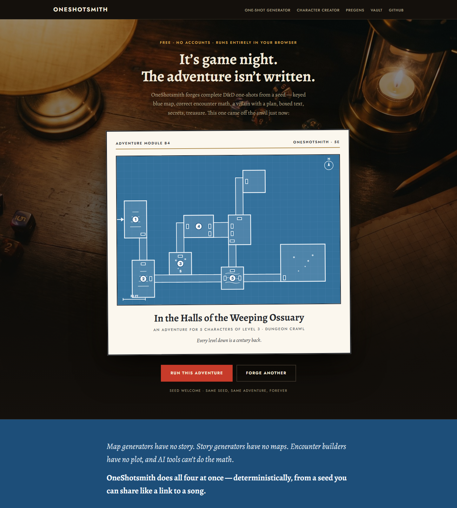
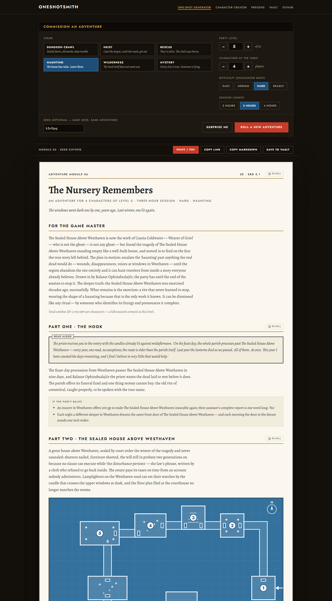
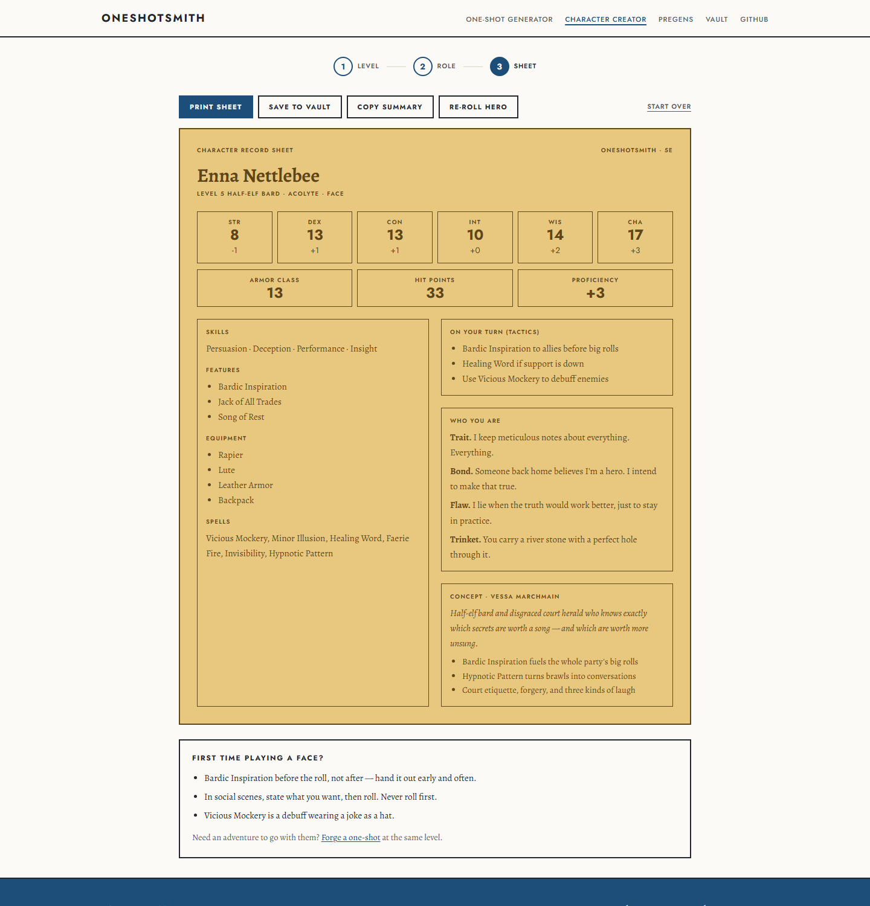

# OneShotsmith

[](https://github.com/rages4calm/oneshotsmith/actions/workflows/ci.yml)
[](https://github.com/sponsors/rages4calm)
[](LICENSE)

**Complete D&D 5e one-shot adventures, forged from a seed — map, math, and story in one click.**

**▶ Try it live: [carl-prewitt.com/oneshot](https://carl-prewitt.com/oneshot)**

OneShotsmith generates a full, runnable adventure module in your browser: a keyed
dungeon map in the classic blue style, encounters built on the real DMG XP math, a
villain with a plan, boxed read-aloud text, NPCs with voices, a secrets checklist,
treasure, pacing — formatted like a proper early-80s adventure module and
print-perfect out of the box. The whole app is set at the game table after dark:
lamplit paper artifacts in a warm black room, with the blue map glowing at the
center of it. No accounts. No server. No AI API. Free forever.

**Every adventure is deterministic.** The seed lives in the URL, so a module can be
shared, bookmarked, or posted like a link to a song — same seed, same adventure,
forever.



---

## Why this exists

The tools DMs actually use each solve a quarter of the problem: map generators have
no story, story generators have no maps, encounter builders have no plot, and AI
tools can't do the math. OneShotsmith does all four at once, coherently — the
numbered rooms on the map *are* the scenes in the text, and the fights in those
scenes are budgeted for your exact party.

## What a generated module contains

Every module ships the full anatomy of a professionally written one-shot:

- **A synopsis for the GM** — what's really going on, twist included
- **A strong-start hook** with boxed read-aloud text, plus fallbacks for reluctant parties
- **A keyed site map** — procedurally generated, drawn white-on-blue like the classic
  modules, with a player-safe version that prints as a separate handout
- **4–6 scenes** matched to your session length, each with read-aloud text, DM notes,
  and a decision or lever — never just description
- **Scene transitions** — "getting there" connective text between every scene,
  generated from the map's actual geometry (direction, distance, doors) and aware
  of what kind of scene just ended and what kind begins
- **A floating spare scene** to drop in if the table runs fast, alongside the cut
  list for tables running slow
- **A first-time-DM primer** — the whole job in eight lines, so someone who has
  never run a game can pick this up and go
- **Encounters with honest math** — 2014 DMG XP thresholds and multipliers for your
  exact party size and level, monster stat lines inline (SRD 5.1), and Sly Flourish's
  Lazy Encounter Benchmark as a second opinion that flags the edge cases XP math misses
- **A villain with a motivation, plan, secret, and mannerism** — and a stat block
- **Three cast NPCs** with appearance, mannerism, voice cue, want, and secret
- **Eight secrets & clues** to reveal wherever the players look (Lazy DM style)
- **A twist**, treasure parcels, and a signature magic item with a history
- **Scaling advice** for weaker/stronger tables, a session clock, a cut list for
  running behind, and theme-specific random tables



## Agent-ready: WebMCP built in

OneShotsmith registers eight [WebMCP](https://webmachinelearning.github.io/webmcp/)
tools, so an AI agent in your browser can drive the generator with typed
parameters instead of scraping the page — and you watch the module change as it
works. Ask for *"a three-hour haunting for four level-5 players, then keep the map
but give me a different villain"* and it happens, on screen, with the encounter
math still correct and the permalink still reproducible.

The division of labor is the point: **the agent brings language and taste; the page
brings the DMG math, the keyed map, and exact reproducibility.** Neither can do the
other's job. Full details, tool table, and local test instructions: **[WEBMCP.md](WEBMCP.md)**.

## Features

| | |
|---|---|
| **Six themes** | Dungeon Crawl, Heist, Rescue, Haunting, Wilderness, Mystery — each a deep, hand-written content system, not a mad-lib |
| **Real knobs** | Level 1–20, party size 2–7, four difficulties, 2/3/4-hour session length (the structure actually changes) |
| **Surgical re-rolls** | New villain, same map. New twist, same everything else. Every section has its own dice, and re-rolls stay in the shareable URL |
| **Shareable seeds** | The whole adventure derives from the URL — share it, bookmark it, post it |
| **Print-perfect** | Print/PDF produces a real module: boxed text, keyed entries, stat tables, and the player-map handout on its own page |
| **Markdown export** | One click copies the entire module as clean Markdown for Obsidian, Notion, or your prep doc |
| **Local vault** | Save adventures and characters in your browser — rename, reopen, export JSON |
| **Character creator** | Pick a role and level, get a complete legal 5e character on a goldenrod-style record sheet with tactics that tell you what to do on your turn |
| **Pregen library** | Ready-made heroes with concepts, voices, and jobs |
| **WebMCP tools** | Eight registered tools let an AI agent generate, re-roll, re-budget, read, and print modules — mirroring the UI exactly ([WEBMCP.md](WEBMCP.md)) |



## Quick start

```bash
git clone https://github.com/rages4calm/oneshotsmith.git
cd oneshotsmith
pnpm install
pnpm dev            # web app on http://localhost:3000
```

Build a static export (deploys anywhere — it's just files):

```bash
pnpm build          # output in apps/web/out
```

Run the test suite (determinism, DMG math, map integrity):

```bash
pnpm test
```

## How the generation works

Everything derives from a seed string through independent, per-section RNG streams
(`hash(seed + section + nonce)`), which is what makes surgical re-rolls possible:
bumping the villain's nonce regenerates the villain — and every sentence that
mentions them — without touching the map, the title, or the treasure.

Re-rolls can't tangle, no matter what order you roll in: every re-roll re-runs
the whole pipeline from scratch as a pure function of `(seed, settings,
nonce-map)` — there is no incremental state to get out of sync, and the test
suite proves order-independence directly. Cross-scene story references resolve
through a **story-flag pass** (design credit: u/tentkeys): a scene's `provides`
tags set flags, and any text can write `{?confession:clean confident
reference|self-contained fallback}` — so "per the warden's confession" appears
only in adventures where that scene was actually rolled, a DC-based fallback
renders otherwise, and re-rolls simply re-gather the flags. Tests assert no
adventure can ever mix branches or leak an unresolved span.

- `packages/core/src/data/themes/` — six theme packs: sites, hooks, villains,
  twists, clue pools, scene templates, complications (~3,000 lines of original,
  playable content)
- `packages/core/src/data/monsters.ts` — 80+ SRD 5.1 monsters with CR, XP, and
  stat lines, tagged for theme palettes
- `packages/core/src/data/encounter-math.ts` — the 2014 DMG thresholds and
  multipliers, the 2024 revised budgets, adventuring-day XP, and the Lazy Benchmark
- `packages/core/src/generators/oneshot.ts` — assembles the module: scene
  structure by session length, encounter building against the party budget, clue
  distribution, pacing
- `packages/core/src/generators/dungeon-map.ts` — procedural site maps (room
  placement, corridor MST with loops, doors, features), rendered as SVG in the
  classic blue style

## Project structure

```
apps/
  web/                  Next.js 15 app (static export — no server required)
packages/
  core/                 The engine: generators, theme packs, SRD data, math
  ui/                   Shared UI primitives
  adapters/, db/        Scaffolding for future VTT export / sync (unused at runtime)
```

## Is this AI?

Honest answer, both halves:

- **At runtime: no.** The generator makes zero AI calls. Every adventure is
  deterministic, seeded table-assembly — the same math donjon or a stack of
  printed random tables uses, which is why the same seed produces the same
  module forever, offline, on any machine.
- **In the workshop: yes.** The code and the content libraries were built by
  Carl working with Claude as the tool — directed, curated, tested, and
  bug-fixed by a human (and by community feedback: several fixes in this repo
  came straight from Reddit playtest reports). The encounter math comes from
  the published DMG tables, not from a model's guess.

Every random table is plain TypeScript in
[`packages/core/src/data/themes/`](packages/core/src/data/themes/) — readable,
editable, and replaceable. If you'd rather run your own hand-written tables,
fork it and swap the files; the engine won't know the difference.

## Legal

- **Code:** MIT License
- **Game content:** This work includes material from the System Reference Document
  5.1 ("SRD 5.1") by Wizards of the Coast LLC, available at
  https://www.dndbeyond.com/srd. The SRD 5.1 is licensed under the Creative Commons
  Attribution 4.0 International License. OneShotsmith is an independent product and
  is not affiliated with Wizards of the Coast.
- All adventure prose, names, and theme content are original.

## Roadmap

- Universal VTT export (`.uvtt` walls/doors/lighting for Foundry, Roll20, Arkenforge)
- A "run mode" initiative tracker preloaded with the module's monsters
- Pregen party pack matched to the generated adventure's hooks
- 2024 rules toggle surfaced in the UI (the math already ships in the engine)

## Support the smithy

OneShotsmith is free forever — no accounts, no ads, no paywalled themes. If it
saved your game night and you'd like to keep the forge lit,
**[sponsoring on GitHub](https://github.com/sponsors/rages4calm)** buys the
coffee that the next feature runs on. A star helps other DMs find it, too.

## Credits

- **[u/tentkeys](https://www.reddit.com/user/tentkeys)** — playtest hero. Read
  the actual generated output closely enough to catch the cross-scene reference
  bug (with reproducing seeds!), pushed for the GM quick-reference summary, and
  contributed design guidance on re-roll state handling. Several fixes in this
  repo trace [directly to that feedback](https://www.reddit.com/r/dndnext/comments/1v056gf/one_shot_generator/).
- Sly Flourish's Lazy DM methodology and Lazy Encounter Benchmark, and Johnn
  Four's Five-Room Dungeon model, inform the adventure structure.
- Dice, lamplight, and table photography generated by Carl on Gemini.

---

Built by [Carl Prewitt Jr](https://github.com/rages4calm).
